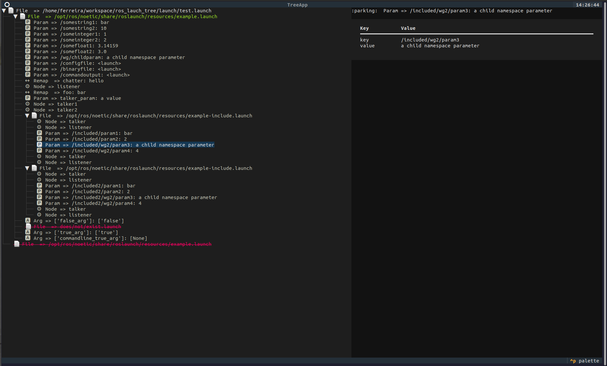

# ROS Launch Tree

ROS launch tree is a visualizer for ROS launch files. It allows you to debug and check what it is being launched.



## Dependencies

Check dependencies on **requirements.txt**.

To setup the virtual environment, run:
```console
python-3 setup.py
```

## Usage
Activate virtual environment:
```console
source venv/bin/activate
```

Run the program:
```console
ros_launch_tree <path_to_launch_file>
```

For demo, run:
```console
ros_launch_tree
```

## Developer
Run tests with:
```console
venv/bin/python3 -m unittest discover tests
```
